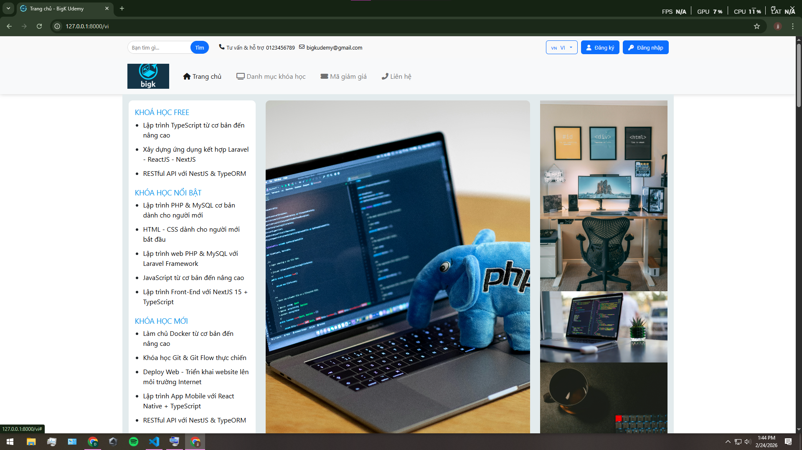
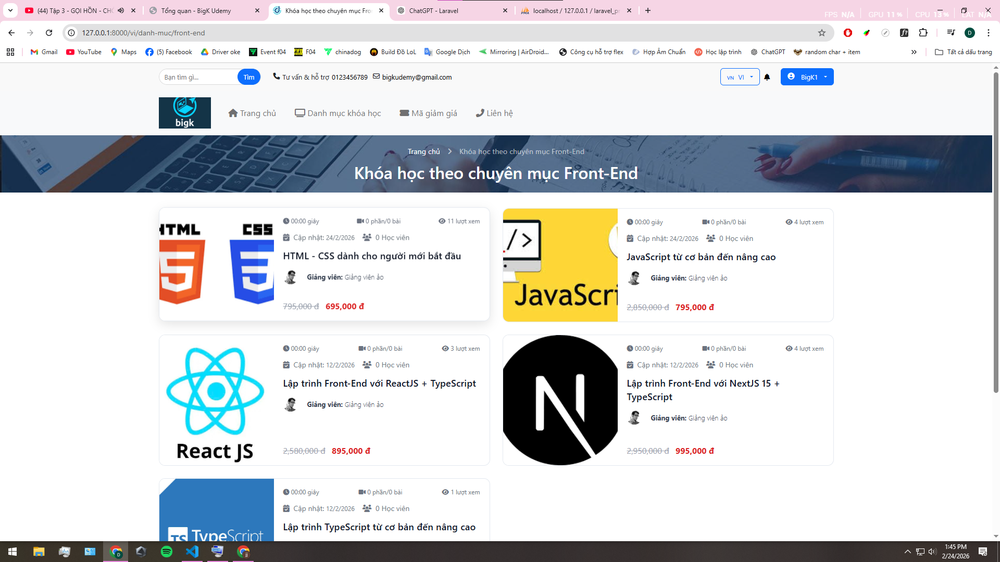
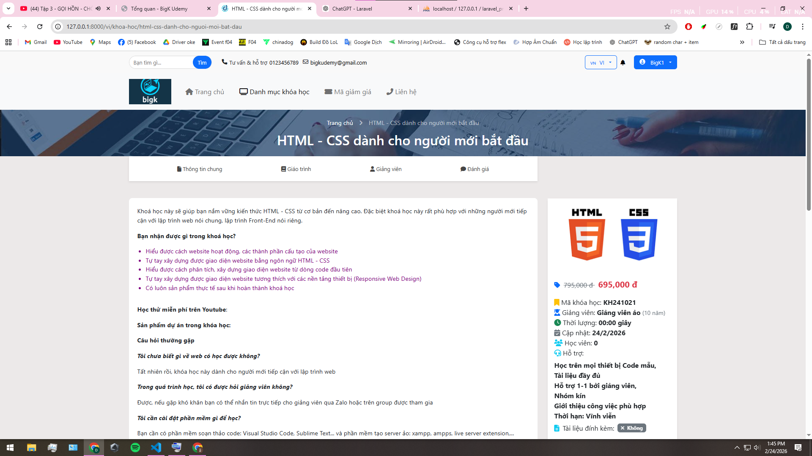
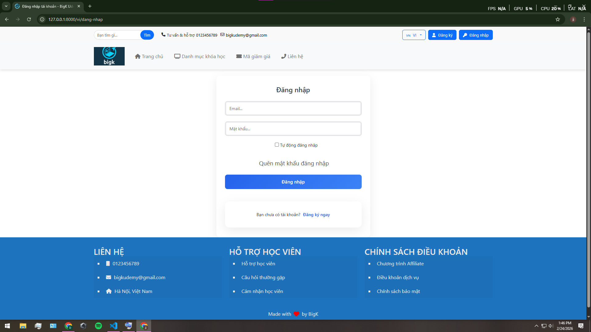
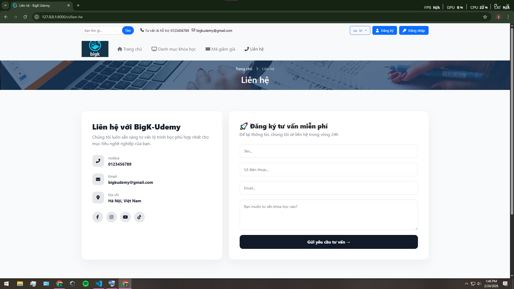
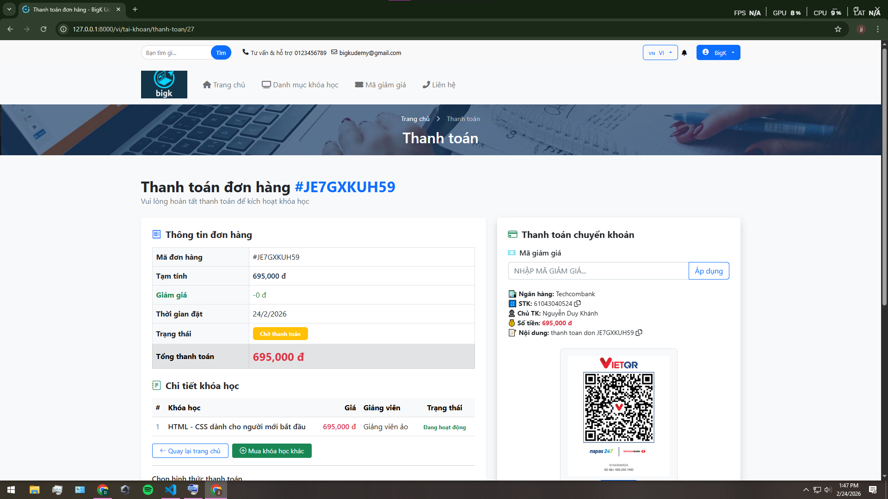
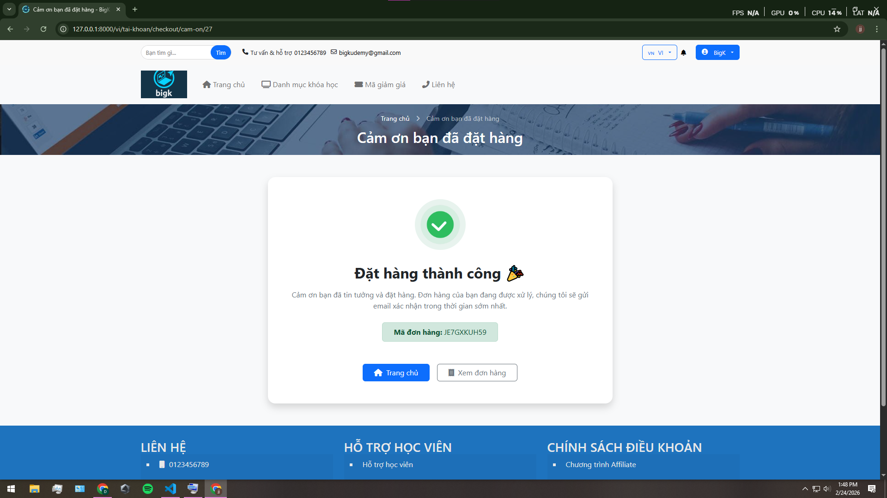
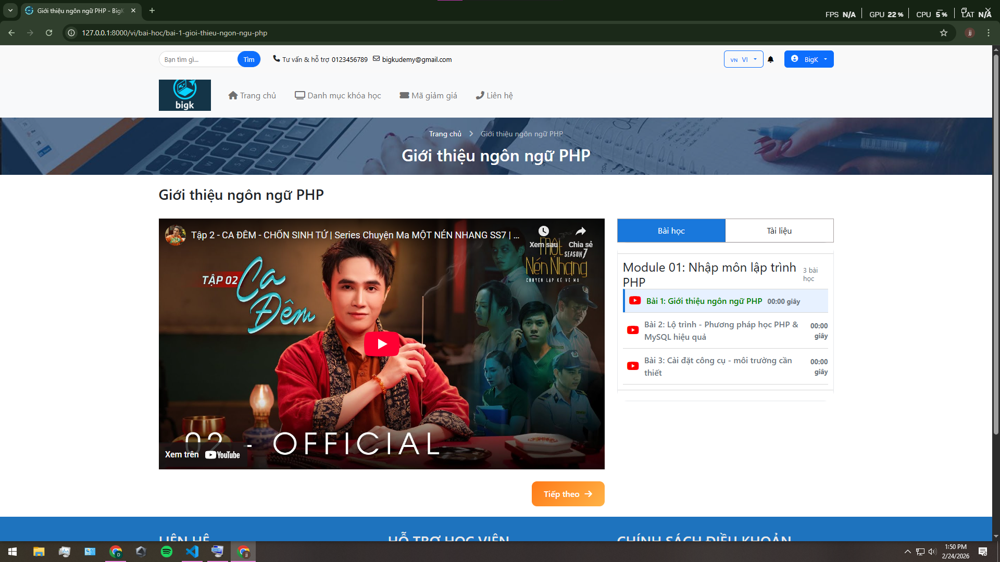
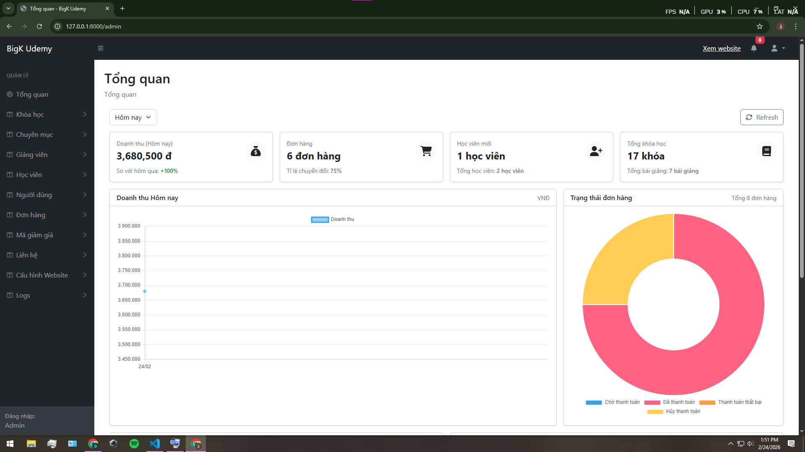

# Nền tảng khóa học Laravel (Đa ngôn ngữ VI/EN)

[English](README.md)

Một nền tảng khóa học dựa trên Laravel với giao diện người dùng đa ngôn ngữ (tiếng Việt/tiếng Anh) và bảng điều khiển quản trị.

Đây là nền tảng khóa học được xây dựng bằng **Laravel**, hỗ trợ:

- Client đa ngôn ngữ (Tiếng Việt / English)
- Trang quản trị (Admin Panel)
- Xác thực email (Email Verification)
- Queue xử lý gửi mail
- CKEditor
- Laravel File Manager
- Toastify
---

# Yêu cầu hệ thống

- PHP >= 8.x
- Composer
- Node.js + NPM
- MySQL / MariaDB

---

# Hướng dẫn cài đặt sau khi clone

## 1) Clone project và cài đặt dependency

```bash
git clone <LINK_REPO_CUA_BAN>
cd <TEN_THU_MUC_PROJECT>
```

```bash
composer install
npm install
```

2. Tạo file .env

```bash
cp .env.example .env
php artisan key:generate
```

3. Cấu hình Database

```bash
Mở file .env và chỉnh:

DB_CONNECTION=mysql
DB_HOST=127.0.0.1
DB_PORT=3306
DB_DATABASE=TEN_DATABASE
DB_USERNAME=TEN_USER
DB_PASSWORD=MAT_KHAU
```

4. Migrate & Seed dữ liệu

```bash
php artisan migrate --seed

✅ Tài khoản Admin mặc định (được tạo bởi Seeder)

Email: admin@gmail.com

Password: 12345678
```

5. Tạo storage link (bắt buộc cho upload & file manager)

```bash
php artisan storage:link
```

6. Build Frontend

```bash
Chạy môi trường development:

npm run dev

Chạy production:

npm run build
```

7. Chạy project

```bash
php artisan serve
```

Truy cập:

Client Tiếng Việt:
http://127.0.0.1:8000/vi

Client English:
http://127.0.0.1:8000/en

Admin Panel:
http://127.0.0.1:8000/admin/

Xác thực Email (QUAN TRỌNG)

Học viên đăng ký bắt buộc phải xác thực email.

Bạn cần cấu hình SMTP trong .env.

Ví dụ dùng Gmail:

```bash
MAIL_MAILER=smtp
MAIL_HOST=smtp.gmail.com
MAIL_PORT=587
MAIL_USERNAME=your_email@gmail.com
MAIL_PASSWORD=app_password
MAIL_ENCRYPTION=tls
MAIL_FROM_ADDRESS=your_email@gmail.com
MAIL_FROM_NAME="${APP_NAME}"
```

Sau khi chỉnh sửa .env, chạy:

```bash
php artisan config:clear
php artisan cache:clear
```

Queue (BẮT BUỘC nếu dùng gửi mail)

Project sử dụng Laravel Queue để gửi email xác thực.

Chạy worker:

```bash
php artisan queue:work
```

⚠️ Lưu ý: Nếu không chạy queue, email xác thực sẽ không gửi.

CKEditor & Laravel File Manager

Đảm bảo đã chạy:

```bash
php artisan storage:link
```

Nếu package file manager yêu cầu publish config:

```bash
php artisan vendor:publish
```

(Tùy package bạn đang sử dụng)

Cấu hình đa ngôn ngữ (VI / EN)

Client sử dụng prefix ngôn ngữ:

/vi

/en

File ngôn ngữ nằm tại:

resources/lang/vi/
resources/lang/en/

Nếu thiếu bản dịch, kiểm tra các file:

resources/lang/vi/_.php
resources/lang/en/_.php
Cấu trúc chính

Client: giao diện người dùng

Admin: quản lý khóa học, đơn hàng, học viên

Orders: quản lý đơn hàng

Students: quản lý học viên

Dashboard: thống kê
Client:

### 🔹 Khách hàng



### 🔹 Khóa học



### 🔹 Chi tiết khóa học



### 🔹 Mã giảm giá


### 🔹 Đăng nhập/Đăng ký



### 🔹 Liên hệ



### 🔹 Thanh tóan



### 🔹 Cảm ơn


### 🔹 Chi tiết hóa đơn



### 🔹 Bài giảng



Admin:

### 🔹 Trang chủ Admin


Xử lý lỗi thường gặp

1. Lỗi thiếu bảng failed_jobs

Chạy:

```bash
php artisan queue:table
php artisan migrate
```

2. Không gửi được mail

Kiểm tra lại SMTP trong .env

Kiểm tra đã chạy queue chưa:

```bash
php artisan queue:work
```

3. Không load được CSS/JS

Chạy lại:

```bash
npm run dev

hoặc

npm run build
```

Tác giả

Author: BigK

Liên hệ: <khanhbeotixiu9x@gmail.com>
